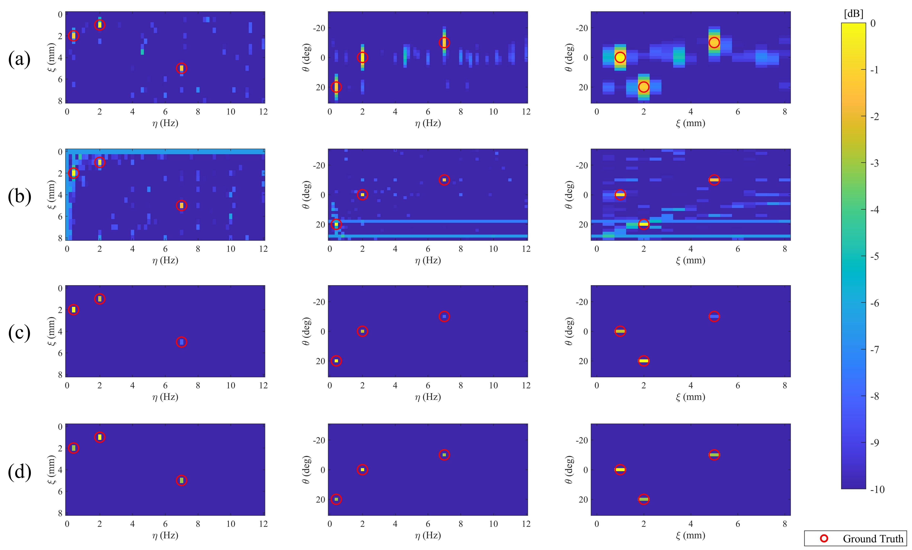

# Spectral-GBSAR
Spectral estimation model for linear displacement and vibration monitoring with GBSAR system 

This repository demonstrates how to retrieve fast linear or vibrational displacemens from Ground-based SAR (GBSAR) signal, while maintaining high spatial resolution using spectral estimation.
## Usage
run "AzVel_RT.m" to simulate a scenario, where scatterers are moving in a linear pattern during the SAR imaging.

run "AzVel.m" to simulate a scenario, where scatterers are moving in a linear pattern while a fixed MIMO radar is collecting signal with a fixed rate.

run "AzVib_RT.m" to simulate a scenario, where scatterers are vibrating during the SAR imaging.

run "AzVib.m" to simulate a scenario, where scatterers are vibrating while a fixed MIMO radar is collecting signal with a fixed rate.

*Below, I have included some figures to better illustrate the outputs of the codes and the contributions of this work. By running the codes, you should obtain similar results.*

## MIMO vs SAR
<p align="center">
 
</p>

Note that MIMO radars typically use multiple physical antennas in an efficient geometry to enable cross-range resolution (also known as angle of arrival or azimuth resolution). Because of this capability, they have sub-second data acquisition rates and can be suitable for fast displacement monitoring. However, due to the limited number of physical antennas, they have lower resolution compared to SAR. SAR achieves cross-range resolution by moving a monostatic antenna along a predefined trajectory. Depending on the length of the trajectory, SAR can significantly improve cross-range resolution, but this comes at the cost of lower temporal resolution (data acquisition rate).

## Linear velocity detection

Below shows the results of linear velocity and angle of arrival detection results in MIMO or SAR imaging modes unsing Capon algorithm: a) MIMO, b) SAR, c) MIMO+CLEAN, d) SAR+CLEAN
<p align="center">
 
</p>

*Note: CLEAN is a helper algorithm further improving the detection of peak signals with reducing the effects of sidelobes*

## Effect of SAR trajectory in correct detection of Linear velocity

The following illustrates how the SAR trajectory can affect the retrieval of scatterers' angles of arrival and linear velocity. In this case, the conventional linear trajectory might not be the suitable option as the phase history of the linearly moving target can be cancelled out.

<p align="center">
 
</p>

## Vibration detection

Below shows the results of vibration and angle of arrival detection results in MIMO or SAR imaging modes unsing Capon algorithm: a) MIMO, b) SAR, c) MIMO+CLEAN, d) SAR+CLEAN

<p align="center">
 
</p>

*Note that, in contrast to the linear displacement scenario, we can use the conventional linear SAR trajectory here. This approach enables us to achieve much higher cross-range resolution improvement compared to the MIMO imaging mode!*

## Paper

If this repository piqued your interest in this work, you can read the full paper from the following links:

*Spectral estimation model for linear displacement and vibration monitoring with GBSAR system*

[Elsevier](https://doi.org/10.1016/j.ymssp.2023.110916) 

[ResearchGate](https://www.researchgate.net/publication/377880118_Spectral_estimation_model_for_linear_displacement_and_vibration_monitoring_with_GBSAR_system)

If you became even more interested, take a look at some of my other related works :)
[Enabling High-Resolution Micro-Vibration Detection Using Ground-Based Synthetic Aperture Radar: A Case Study for Pipeline Monitoring](https://www.mdpi.com/2072-4292/15/16/3981)

[Micro-vibration monitoring of pipelines using millimetre-wave MIMO radar](https://www.tandfonline.com/doi/abs/10.1080/2150704X.2023.2291424)

## Citation
Finally, don't forget to cite this work if you find it usefull:
```
@article{Spectral-GBSAR,
	title = {Spectral estimation model for linear displacement and vibration monitoring with GBSAR system},
	volume = {208},
	doi = {doi.org/10.1016/j.ymssp.2023.110916},
	pages = {110916},
	journaltitle = {Mechanical Systems and Signal Processing},
	author = {Hosseiny, Benyamin and Amini, Jalal and Aghababaei, Hossein},
	date = {2024/2/15},
	note = {Publisher: Elsevier},
	keywords = {Deformation monitoring, Multiple Input Multiple Output (MIMO) radar, SAR interferometry, Beamforming, Capon, MUSIC, CLEAN},
}
```
